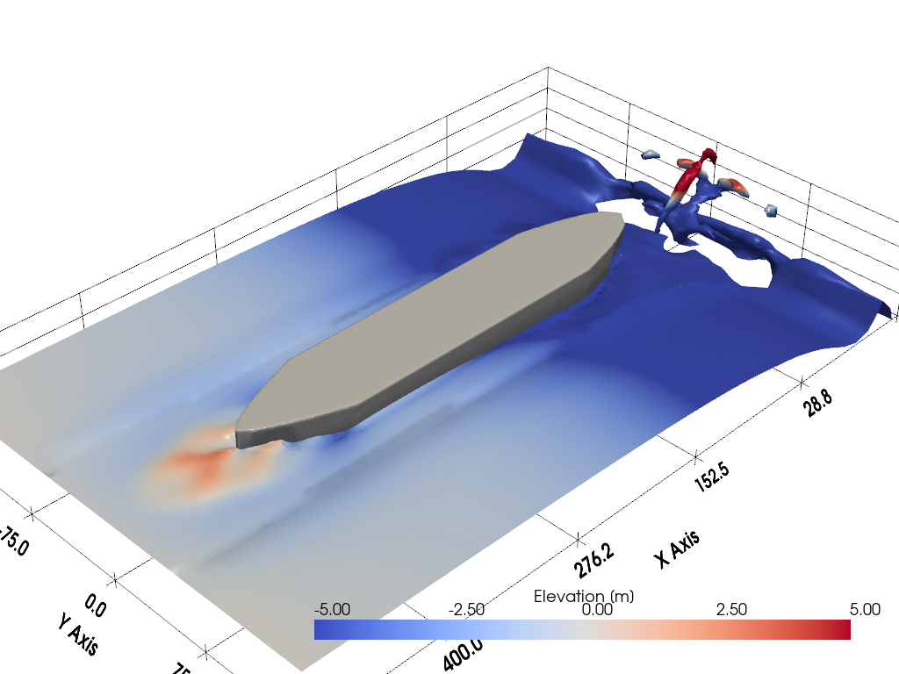
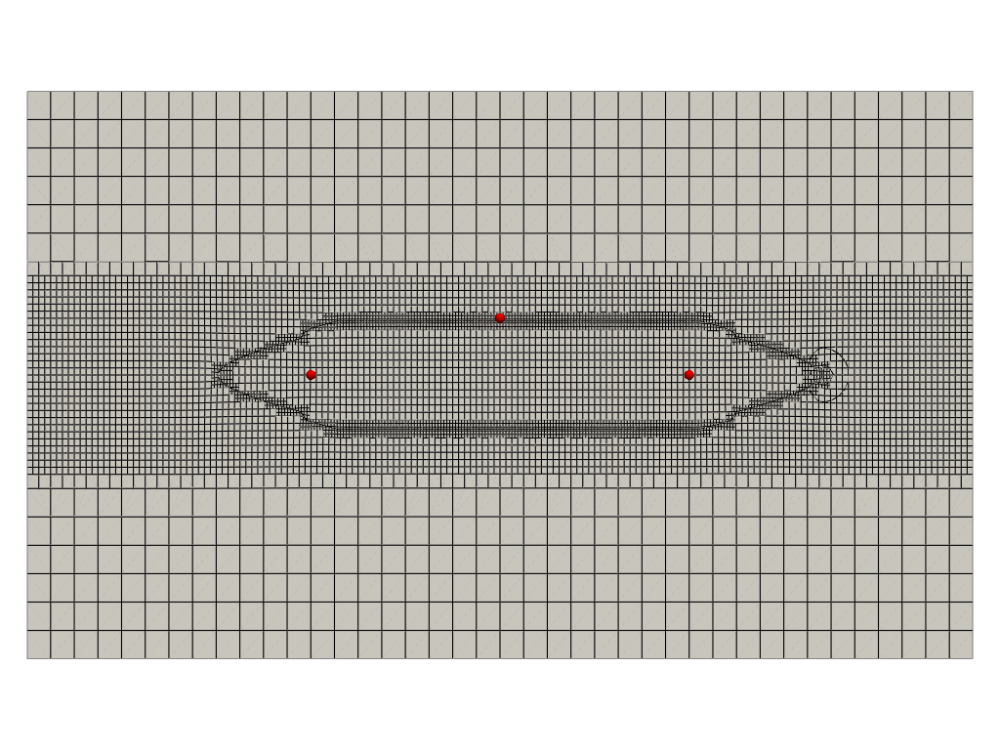
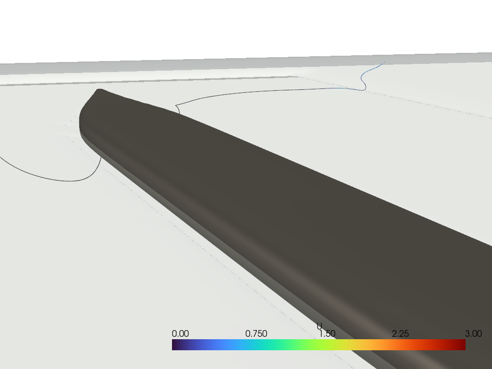
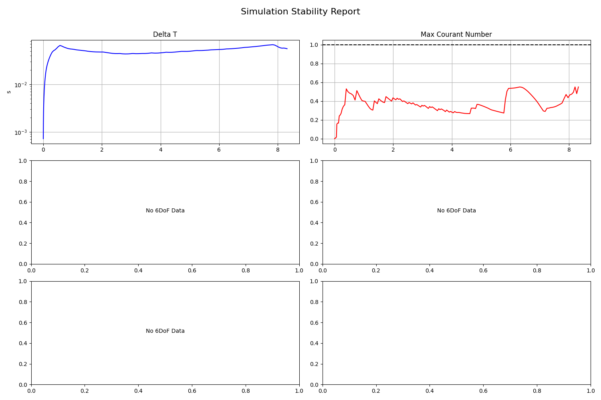

# JAX Vessels



The visualization above shows the **free surface elevation** (wave height) generated by the KVLCC2 tanker hull moving at speed.
*   **Color Scale**: Represents wave height in meters relative to the calm water line (Z=0).
    *   **Red**: Crests (positive elevation).
    *   **Blue**: Troughs (negative elevation).
    *   **Range**: The scale is clamped to **[-5, 5] meters** to clearly highlight the steady-state [Kelvin wake pattern](https://en.wikipedia.org/wiki/Kelvin_wake), characterized by divergent and transverse waves.
*   **Note**: Transient start-up effects can produce larger "splash" values (up to +/- 40m) at the boundaries, which are saturated in this view to focus on the hydrodynamics around the hull.
*   **Method**: Extracted from the Volume of Fluid (VOF) field `alpha.water` isosurface at 0.5.

## Overview

This repository contains tools for:
1.  **Procedural Hull Generation**: Creating parametric ship geometries (Tankers, Barges) using Python and Blender.
2.  **CFD Integration**: Automated mesh generation and resistance simulation using OpenFOAM.
3.  **Optimization**: Using JAX to learning and minimize resistance surrogates.

## Simulation Methodology

This project utilizes a robust OpenFOAM-based CFD pipeline to model ship hydrodynamics.

### Test Case Hierarchy
We build up the complexity of the simulation in steps to validate the physics incrementally:

| Case Name | Description | Physics Verified | Key Features |
| :--- | :--- | :--- | :--- |
| **1. still_water** | Water and air at rest in a box. | Hydrostatic stability, Phase conservation. | `blockMesh` only, No ship, Flat surface. |
| **2. inverse_barometer** | Standard pressure gradient applied to surface. | Pressure-Elevation coupling (Inverse Barometer). | `codedFixedValue` BC, Tilted surface. |
| **3. wave_tank** | A wave propagating through the domain. | Momentum advection, Interface capturing (VOF). | Initialized wave/dam-break, simple mesh. |
| **4. kcs_hull** | Ship hull in open water. | Fluid-Structure Interaction, Turbulence. | `snappyHexMesh`, Turbulence Model, `forces`. |

### Modelling Approach
The simulation uses the **Volume of Fluid (VOF)** method to capture the free surface (water-air interface) using the `interFoam` solver.

*   **Real World Element** -> **Model Representation**
    *   Ship Hull -> STL Surface (No-slip wall)
    *   Ocean/Air -> Multiphase Fluid (`alpha.water` field: 0=air, 1=water)
    *   Open Sea -> Rectangular Computational Domain with RANS + k-Omega SST turbulence modelling.

#### Frame of Reference
The simulation utilizes a **body-fixed Eulerian reference frame**.
*   **Stationary Ship**: The ship hull is fixed in space ($U_{ship} = 0$).
*   **Moving Water**: The water flows past the hull with a defined velocity.
*   This mimics a circulating water channel test and avoids dynamic mesh motion complexity.

#### Coordinate System
We follow standard naval architecture conventions aligned with OpenFOAM's default orientation:
*   **Origin (0,0,0)**: Intersection of **Midship Section**, **Centerline**, and **Design Waterline**.
*   **X-Axis (Longitudinal)**: Positive forward (Towards Bow). $x \in [-L/2, L/2]$.
*   **Y-Axis (Transverse)**: Positive Port (to the left when looking forward). $y \in [-B/2, B/2]$.
*   **Z-Axis (Vertical)**: Positive Up. $z=0$ is the Still Water Level (Draft line).
*   **Units**: Meters ($m$).

### Shallow Water & Phase-Coupled Soft Start (New in v0.2.2)
To simulate **realistic inland waterways** (rivers/canals):
*   **Depth**: The domain is explicitly set to **10m** (z-min = -10).
*   **Bathymetry**: The bottom boundary is a **Slip Wall** (hard riverbed) rather than a symmetry plane.
*   **Soft Start**: The inlet velocity ramps from 0 to target (e.g., 2 m/s) over 10s to prevent impulse shocks.
*   **Phase Coupling**: Air velocity is strictly zeroed at the inlet ($U_{air} = 0$), while water follows the ramp ($U_{water} \propto \alpha \cdot t$). This prevents unphysical high-speed air currents.


*Figure: Cross-section of the mesh generation showing the immersed boundary representation.*

### Visual Showcase

*Figure: Zoomed-in view of the hull interaction with the shallow water flow (initialization phase), showing streamlines colored by velocity.*

## Documentation
*   [OpenFOAM Case Setup](docs/openfoam_setup.md): Explanation of the simulation template.
*   [Test Case Templates](docs/templates/index.md): Detailed documentation of the specific templates.

## Simulation Workflow

The following Directed Acyclic Graph (DAG) illustrates the automated simulation pipeline managed by **Snakemake**:


This workflow ensures:
1.  **Hull Assembly**: Procedural generation and cleaning.
2.  **Mesh Generation**: `snappyHexMesh` with quality checks.
3.  **Hydrostatics**: Automated calculation of Mass and CoM.
4.  **Simulation**: Robust 6DoF execution using the derived physical properties.
5.  **Monitoring**: Real-time stability tracking.

## Running Test Cases

The `templates/` directory contains standard OpenFOAM cases.

### Automated Execution (Snakemake) - Recommended

We use [Snakemake](https://snakemake.readthedocs.io) to manage the entire simulation workflow, from hull generation to report creation.

1.  **Configure**: Edit `config.yaml` to select the hull, wave conditions, and load case.
    ```yaml
    cases:
      - hull: "wigley"
        wave: "still"
        motion: "floating"
        load: "empty"
    ```

2.  **Run Workflow**:
    ```bash
    # Run the full workflow (requires Docker)
    uv run snakemake -c 6
    ```

3.  **View Results**:
    Open `build/wigley/report.html` (or your specific case) to see the summary and monitoring plots.

#### Visualizing the Workflow
To see the DAG of the current configuration:
```bash
uv run snakemake --dag | dot -Tpng > dag.png
```

### Manual Execution (Debugging)
To run a test case manually (e.g., `kcs_hull`):

1.  **Copy the template** to a run directory to keep the original clean:
    ```bash
    mkdir -p simulations
    cp -r templates/kcs_hull simulations/my_kcs_test
    cd simulations/my_kcs_test
    ```

2.  **Generate Mesh and Fields**:
    ```bash
    blockMesh
    surfaceFeatureExtract
    snappyHexMesh -overwrite
    setFields
    ```

3.  **Run Simulation**:
    *   **Serial**:
        ```bash
        interFoam
        ```
    *   **Parallel (Faster)**:
        The case is configured for 6 cores (`system/decomposeParDict`).
        mpirun -np 6 interFoam -parallel
        reconstructPar
        ```

### Stopping a Run
If you need to abort a running simulation, use the provided helper script which safely terminates Snakemake, Python monitors, and Docker containers:

```bash
./scripts/utils/stop_simulation.sh
```

      ## Model Philosophy and Verification

### Verification Matrix
We employ a 4-step "Crawl, Walk, Run" verification matrix to isolate sources of instability:
1.  **Static Still**: Baseline mesh/solver stability.
2.  **Static Waves**: Wave boundary condition stability.
3.  **Dynamic Still**: 6DoF solver stability.
4.  **Dynamic Waves**: Full coupled physics.

See the [Verification Report](docs/verification_report.md) for detailed results and stability plots.

### Stability Verification (Matrix 1)

*Figure: Baseline stability verification for Static Hull in Still Water.*

We employ a systematic, 4-step verification strategy to ensure simulation stability and physical correctness. Each template builds upon the previous one, adding a single layer of complexity:

1.  **Still Water (`templates/still_water`)**: 
    *   **Goal**: Verify numeric solver stability.
    *   **Setup**: Shuttle water domain (depth 10m), no object, no flow.
    *   **Success Criteria**: Zero max velocity, stable time step.

2.  **Wave Tank (`templates/wave_tank`)**:
    *   **Goal**: Verify boundary conditions and wave propagation.
    *   **Difference**: Adds **Inflow** (or wave generation) to the Still Water base.
    *   **Success Criteria**: Stable wave propagation, non-reflective outlet.

3.  **Static Hull (`templates/floating_hull` with `staticFvMesh`)**:
    *   **Goal**: Verify meshing (`snappyHexMesh`) and hydrostatics.
    *   **Difference**: Adds the **Hull Geometry** to the Wave Tank.
    *   **Setup**: Hull is fixed (static). Water depth 10m.
    *   **Success Criteria**: Successful mesh generation, correct displacement/draft.

4.  **Dynamic Hull (`templates/floating_hull` with `sixDoF`)**:
    *   **Goal**: Verify rigid body dynamics.
    *   **Difference**: Adds **6DoF Motion** to the Static Hull.
    *   **Success Criteria**: Stable heave/pitch motion, physical settling.

**Consistent setup**: All simulations are configured for **Shallow Water** (Depth = 10m) to represent realistic inland shipping conditions.
    Open the generated `.vtk` files in the `VTK/` directory using ParaView.

## Validation

We provide an automated test suite using `pytest` to verify the physical correctness of the templates.

```bash
# Run physics verification tests
pytest tests/test_physics.py
```

## Installation
This project uses `uv` for dependency management.

```bash
# Install dependencies
uv sync

# Run Python scripts using uv run
uv run scripts/core/script_name.py

# Run OpenFOAM commands (Must be in Docker)
./scripts/utils/run_docker.sh <command>
# Example: ./scripts/utils/run_docker.sh foamToVTK

# Run scripts using uv run
uv run scripts/script_name.py
```

## Hull Generation

We provide two methods for generating hull geometries:

### 1. Blender Geometry Nodes (Recommended)
Produces high-quality, organic, and simulation-ready meshes using Blender's procedural node system.

> [!NOTE]
> Requires **Blender 4.0** or later (for STL export support).

```bash
# Generate KVLCC2 Tanker (320m) with Bulbous Bow
blender -b -P examples/scripts/blender_ship_geonodes.py
```

### 2. Python Procedural Script
Fast, standalone generation of basic shapes without Blender dependency.

```bash
# Generate Tanker
python examples/scripts/generate_hull.py --type tanker --out examples/hulls/tanker_kvlcc2_like.stl

# Generate Inland Barge
python examples/scripts/generate_hull.py --type barge --out examples/hulls/barge_inland.stl
```

## Hydrostatics Analysis

We provide a tool to quickly check the hydrostatic properties (displacement, center of buoyancy, etc.) of any STL hull geometry using `meshmagick`.

```bash
# Check hydrostatics for a hull
./scripts/utils/check_hydrostatics.sh <path_to_stl> [water_density] [vertical_cog]
```

Example:
```bash
./scripts/utils/check_hydrostatics.sh templates/kcs_hull/constant/triSurface/hull.stl 1025 0
```


## Running with Docker
We recommend using Docker to ensure a consistent OpenFOAM environment with all dependencies.

1.  **Build the Image**:
    ```bash
    ./scripts/utils/run_docker.sh build
    # Or manually: docker build -t jax-vessels .
    ```

2.  **Run a Simulation**:
    Use the provided wrapper to execute commands inside the container with the current directory mounted:
    ```bash
    ./scripts/utils/run_docker.sh ./scripts/legacy/verify_case.sh kcs_hull
    ```
    
    This will:
    *   Setup the case in `verification_run/kcs_hull`.
    *   Run `blockMesh`, `snappyHexMesh` (with watertight hull).
    *   Run `interFoam` in **parallel (6 cores)**.
    *   Automatically run `foamToVTK` for visualization.

3.  **Run Tests**:
    ```bash
    docker run --rm -it -v $(pwd):/app --entrypoint pytest ship-model tests/
    ```

### Manual Execution in Docker
If you want to run specific OpenFOAM commands manually (debugging):
```bash
# Start a shell with OpenFOAM environment sourced
docker run --rm -it -v $(pwd):/app ship-model run-analysis bash
```
Then, inside the container:
```bash
# Example: Run explicit steps on a test case
cd simulations/my_test_case
blockMesh
checkMesh
foamToVTK
```

## Example Hulls

The `examples/hulls/` directory contains generated STL files ready for simulation.

> [!IMPORTANT]
> When adding new hulls, ensure they meet the [Hull Geometry Requirements](docs/hull_requirements.md) (e.g., watertightness, correct origin).

### `tanker_geometry_node.stl`
**Type**: KVLCC2-like VLCC Tanker  
**Dimensions**: 320m x 58m x 30m  
**Features**:
*   **High-Fidelity Bulbous Bow**: Generated via volumetric fusion of an ellipsoidal primitive and the hull body, resulting in a smooth, organic transition.
*   **CFD-Ready Topology**: Remeshed using a uniform Voxel Grid (0.5m) to produce a structured, quad-dominant mesh ideal for `snappyHexMesh`.
*   **Watertight**: Guaranteed manifold geometry due to the volume-to-mesh workflow.

## Known Issues

### Docker and Root User
OpenFOAM v2406 refuses to load shared objects (dynamic libraries) if they were created by the root user, or if the process is running as root in certain contexts.
- **Symptom**: `Exit code 139` (Segfault) or `cannot open shared object file`.
- **Solution**: The Dockerfile now defaults to the `ubuntu` user. Ensure all OpenFOAM artifacts are owned by the non-root user.

### 6DoF Instability ("Rocket Launch")
If the initial water level (`0/include/setFields.still`) creates more buoyancy than the hull's mass, the solver will experience a massive upward force at $t=0$, causing immediate divergence (velocities > $10^{6}$ m/s).
- **Diagnosis**: Run `scripts/verify_hydrostatics.py` on your hull STL.
- **Solution**: Adjust the `box` height in `setFields.still` to match the **Equilibrium Draft** ($Z_{eq} \approx Volume / Area$).
- **Verification**: The included regression test (`verify_hydrostatics.py`) ensures the imbalance is < 10%.
  ```bash
  uv run scripts/utils/verify_hydrostatics.py verification_run/matrix_6dof_staged
  ```
- **Note**: Empirical tests show OpenFOAM often requires ~10cm more draft than calculated analytically due to mesh discretization differences. The script uses a `+0.10m` offset by default.

## Project Structure

### `tanker_kvlcc2_like.stl`
**Type**: KVLCC2-like Tanker Representation  
**Dimensions**: ~320m length  
**Features**:
*   Generated using pure Python/Numpy mathematical profiles.
*   Explicit mesh construction with a parametric bulbous bow.
*   Good for quick iterate-and-test loops where Blender is not available.

### `barge_inland.stl`
**Type**: CEMT Type IIa Inland Push Barge  
**Dimensions**: 76.5m x 11.4m x 3.5m  
**Features**:
*   Standardized European inland waterway dimensions.
*   Box-shaped midbody with parameterized bow and stern rakes.
*   Suitable for shallow water resistance studies.

### `simple_box.stl`
**Type**: Simple Cuboid  
**Dimensions**: 100m x 20m x 10m (Default)  
**Features**:
*   Pure rectangular geometry ("Shoebox"), ideal for initial verification of the OpenFOAM numerical setup without complex mesh features.
*   Generated via `python examples/scripts/generate_hull.py --type box`.

## Floating Hull Simulation
To simulate a floating vessel (6DoF) in Head Seas (waves hitting the bow), ensuring correct hull orientation is critical. The `blender_nurbs_barge.py` script generates the hull with the Bow at positive X. Since the flow direction is also positive X, this results in "Following Seas" by default.

To correct this for "Head Seas" (Bow upstream):
```bash
bash scripts/utils/run_docker.sh surfaceTransformPoints \
    -yaw 180 \
    -translate '(135 0 0)' \
    examples/vessels/barge_nurbs.stl \
    templates/floating_hull/constant/triSurface/hull.stl
```
This rotates the hull 180° around the vertical axis and translates it back to the domain origin. with configurable stations and profiles.
*   Features a tapered bow and raked stern.

### `barge_geonodes.stl`
**Type**: Parametric Inland Barge (Procedural)  
**Dimensions**: 135m x 14.2m x 4m (Class Va)  
**Features**:
*   Generated using **Blender Geometry Nodes** (`examples/scripts/blender_barge_geonodes.py`).
*   Procedural mesh with configurable stations and profiles.
*   Features a tapered bow and raked stern.

### `barge_nurbs.stl`
**Type**: Parametric Inland Barge (NURBS)  
**Dimensions**: 135m x 14.2m x 4m (Class Va)  
**Features**:
*   Generated using **Python-driven NURBS Surfaces** (`examples/scripts/blender_nurbs_barge.py`).
*   Guaranteed C2 smoothness for high-quality hydrodynamics.
*   Explicitly modeled deck and transom for perfect watertight closure.
*   Pontoon-style hull with flat bottom and bilge radius.

## Release Process

To ensure consistent versioning and avoid regression:

1.  **Check Current Version**:
    *   `gh release list` (or check GitHub) to see the latest tag (e.g., `v0.3.2`).
    *   Ensure your working branch is up to date with `main`.

2.  **Bump Version**:
    *   Update `version = "X.Y.Z"` in `pyproject.toml`.
    *   `git commit -am "chore: bump version to X.Y.Z"`
    *   `git push origin main`

3.  **Create Release**:
    *   Use the `gh` CLI to create the release and tag simultaneously:
    *   `gh release create vX.Y.Z --title "vX.Y.Z: <Title>" --notes "<Description of changes>"`

**Note**: Do not manually tag with `git tag` unless necessary. Let `gh release create` handle it to ensure the release and tag are synced.
