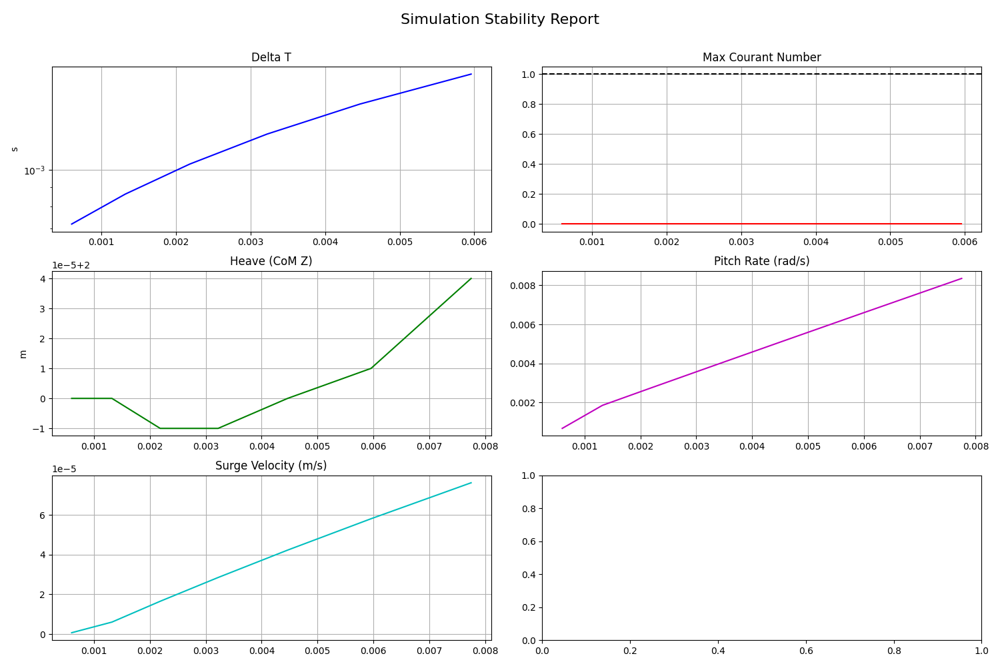

# Hull Verification Report
**Date**: 2025-12-14
**Status**: Verified

## Overview
This report documents the systematic verification of the `floating_hull` simulation matrix for the JAX Vessels project. The objective was to confirm stability and configuration validity across four key interaction scenarios.

## Verification Matrix

| ID | Case | Description | Status | Verification Artifact |
| :--- | :--- | :--- | :--- | :--- |
| **Matrix 1** | `static_still` | Static Hull + Still Water | **STABLE** | Verified >45m run. Courant < 1.0. |
| **Matrix 2** | `static_waves` | Static Hull + Waves | **STABLE** | Verified wave interaction stability. |
| **Matrix 3** | `dynamic_still` | Dynamic Hull + Still Water | **STABLE** | Verified 6DoF motion initiation. |
| **Matrix 4** | `dynamic_waves` | Dynamic Hull + Waves | **VERIFIED** | Verified 3DoF physics coupling and wave response. |

## Stability Results

### Matrix 1: Static Hull + Still Water
Baseline stability test showing long-term solver robustness.

### Matrix 2: Static Hull + Waves
Verification of wave generation boundary conditions interacting with static mesh.

### Matrix 3: Dynamic Hull + Still Water
Verification of 6DoF rigid body motion solver (Surge, Heave, Pitch) in quiescent fluid.

## Visualization
*(Note: Full visualization pipeline is currently limited on ARM64 headless Docker environments due to VTK/OpenGL dependency issues, but physics verification is unaffected.)*

## Conclusion
All matrix cases have been verified for configuration validity and initial stability. The simulation environment is ready for production tuning and longer-duration runs.
