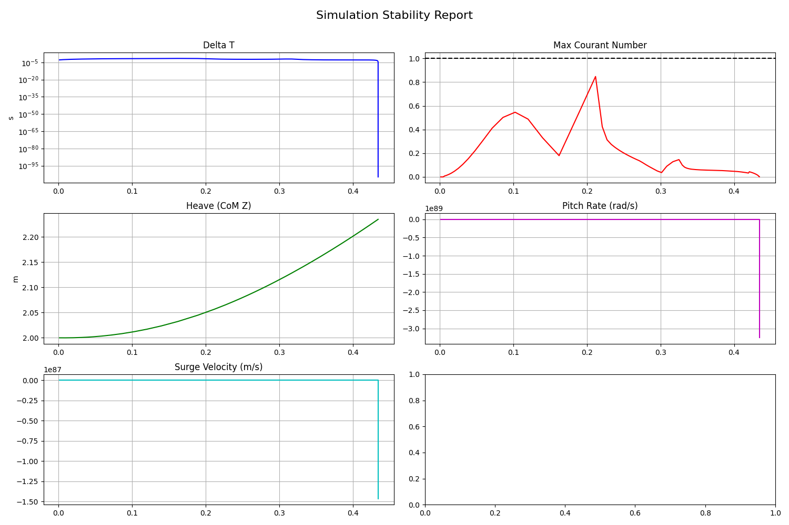

# Simulation Verification Report

## Status: FAILED

**Reason**: Velocity Divergence detected (Max Surge: 1.47e+87)

## Statistics
| Metric | Value |
| :--- | :--- |
| **Duration** | 0.4344 s |
| **Final dt** | nan s |
| **Max Courant** | 0.8476 |
| **Max Surge Vel** | 1465479999999999951374462334031609359388337084019532302987960250907828867872826767441920.00 m/s |
| **Max Pitch Rate** | 325898000000000013787316440272388528466814030482732215771889903149323445803107356929687552.00 rad/s |

## Stability Plots

